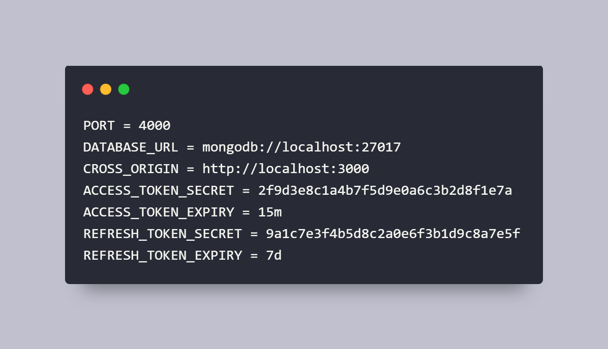
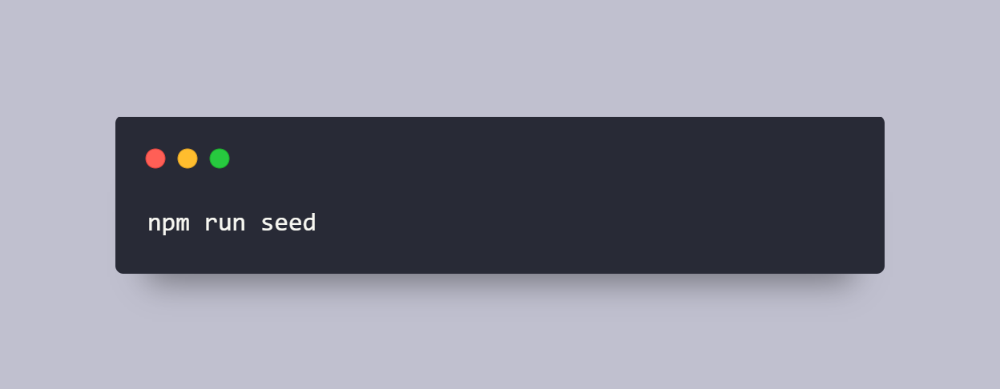

# 🎮 GameWorld  
### 🧑‍💻 BCA Final Year Project  

---

## 📖 Introduction

**GameWorld** is a full-stack web application designed to provide users with an immersive and interactive gaming experience.  
It features a secure **JWT-based authentication system**, **customizable profiles**, and a collection of both **custom-developed and embedded games**.

The project demonstrates seamless integration between frontend and backend technologies — focusing on **user engagement**, **personalization**, and **real-time interaction**.

### 🔑 Key Functionalities

- 🔐 User authentication and session management using **JWT & Cookies**  
- 🧑‍🎨 Profile customization (avatars, usernames, and themes)  
- 🎮 Game history tracking for each logged-in session  
- 🎨 Theme-based UI with multiple color options for personalization  

The **backend**, powered by **Node.js**, **Express.js**, and **MongoDB**, ensures efficient data handling and modular structure.  
The **frontend**, built using **HTML**, **CSS**, and **JavaScript**, delivers a responsive and user-friendly interface.

## 🎯 Objective

The main objective of **GameWorld** is to create a dynamic platform where users can:

- 🔐 **Sign up and log in securely**  
- 👤 **Customize profiles** (avatar, username, and theme)  
- 🎮 **Access both custom-built and embedded games**  
- 🧠 **Track their gameplay** through a “Past Games Played” section  

---

## 🧩 Technologies Used

| **Category** | **Technologies** |
|---------------|------------------|
| 🖥️ Frontend | HTML, CSS, JavaScript, Universe.io (UI Components) |
| ⚙️ Backend | Node.js, Express.js |
| 💾 Database | MongoDB (via Mongoose) |
| 🧰 Tools | Postman (API Testing), GitHub (Version Control), Figma (UI Design) |

## ⚠️ Current Limitations

- 🕹️ The **“View Games / Past Games Played”** section is **session-based** — once a user logs out, their play history is cleared.  
- 🔁 Each new login starts a **fresh session**, meaning previous play history is not retained.  
- 💾 The project currently supports only a **local MongoDB setup** (`mongodb://localhost:27017`).  
- ☁️ It is **not yet configured for cloud-based database deployment**.  
- 🍪 To ensure **JWT cookies** function properly, it is recommended to run the frontend using:

  

instead of using the VS Code Live Server, as Live Server does not handle cookies and secure requests correctly.

---

## ⚙️ Project Setup

Follow the steps below to run **GameWorld** locally 👇  

### 1️⃣ Clone the Repository

  

### 2️⃣ Install Backend Dependencies

Navigate to the backend directory and install required packages:

  

### 3️⃣ Create Environment File (.env)

Create a new .env file inside your Backend folder and add the following environment variables:

  

Example dummy data you can use for testing 👇

  

### ⚠️ Note: After setting up your .env file, first run:

  

This command seeds your database with the necessary dummy data.

Once seeding is complete, start your server using:

  

By default, the backend runs on http://localhost:4000

### 4️⃣ Set Up MongoDB (Local)

Make sure MongoDB is installed and running locally on your system.
Default URL:

  

You can also update the connection URL inside your environment file if needed.

### 5️⃣Run the Frontend

Go back to your project’s frontend directory and run:

  

⚠️ Use npx serve instead of VS Code Live Server to ensure JWT cookie authentication works correctly.

The frontend will usually start on http://localhost:3000
 or another available port.

 ---

 ## 💬 Conclusion

**GameWorld** is not just a gaming platform — it’s a demonstration of practical full-stack web development, combining **UI/UX design**, **API development**, **database management**, and **authentication** into one cohesive project.  

It reflects the journey of **learning**, **experimenting**, and **building something meaningful from scratch.** 🚀